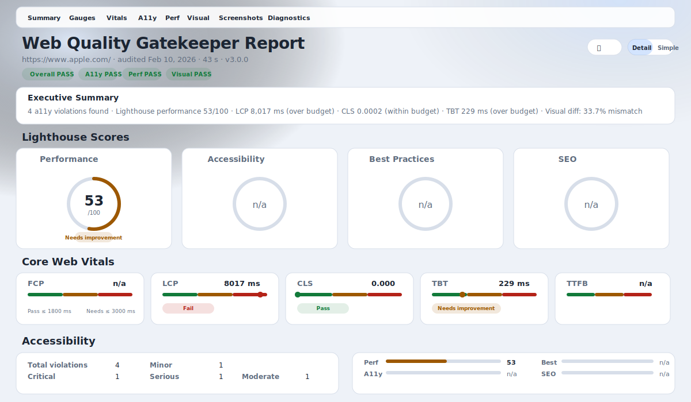

# Web Quality Gatekeeper

[](https://github.com/Jahrome907/web-quality-gatekeeper/actions/workflows/quality-gate.yml)
[](LICENSE)
[](https://nodejs.org/)
[](https://www.typescriptlang.org/)
[](https://codecov.io/gh/Jahrome907/web-quality-gatekeeper)

A production-ready quality gate CLI and GitHub Action that runs Playwright smoke checks, axe accessibility scans, Lighthouse performance audits, and visual regression diffs on every PR. Outputs a clean HTML report plus a machine-readable JSON summary.



## Why This Exists

Lighthouse CI, Pa11y, and similar tools each cover a single concern. Teams end up stitching together three or four actions, juggling separate configs, and parsing multiple output formats. **Web Quality Gatekeeper** runs all four checks (smoke, a11y, perf, visual) in one pass, with a single config file, unified summary output, and a composite GitHub Action that works out-of-the-box in any repo.

|Capability|Lighthouse CI|Pa11y CI|WQG|
|---|:---:|:---:|:---:|
|Performance budgets|Yes|—|Yes|
|Accessibility scanning|—|Yes|Yes|
|Visual regression|—|—|Yes|
|Deterministic screenshots|—|—|Yes|
|Single config + action|—|—|Yes|
|Machine-readable summary|Partial|—|Yes|

## Architecture

```text
┌─────────────────────────────────────────────────┐
│                   CLI / API                      │
│         src/cli.ts  ·  src/index.ts              │
├──────────┬──────────┬──────────┬────────────────┤
│ Playwright│  axe-core │Lighthouse│ Visual Diff   │
│  runner   │  runner   │  runner  │  runner       │
│  (smoke)  │  (a11y)   │  (perf)  │ (pixelmatch)  │
├──────────┴──────────┴──────────┴────────────────┤
│              Config (Zod schema)                 │
├─────────────────────────────────────────────────┤
│        Report (HTML · JSON · Markdown)           │
├─────────────────────────────────────────────────┤
│        Utils (retry · logger · fs · url)         │
└─────────────────────────────────────────────────┘
```

## Table of Contents

- [Why This Exists](#why-this-exists)
- [Architecture](#architecture)
- [Features](#features)
- [Quickstart](#quickstart)
- [CLI Usage](#cli-usage)
- [Programmatic API](#programmatic-api)
- [Baseline Workflow](#baseline-workflow)
- [Configuration](#config)
- [CI Integration](#ci-github-action)
- [Output](#output)
- [Schema Contract](#schema-contract)
- [Case Study & Benchmarks](#case-study--benchmarks)
- [Development](#development)
- [Tech Stack](#tech-stack)
- [License](#license)

## Features

- **Playwright Smoke Runner** — Deterministic screenshots with configurable viewports
- **axe-core Accessibility** — WCAG compliance scanning with severity counts
- **Lighthouse Performance** — Budget enforcement for score, LCP, CLS, and TBT
- **Visual Regression** — Baseline management with pixel-level diff detection
- **Multi-Page Audit** — Audit one URL from CLI or multiple named URLs from config
- **Trend Tracking** — Optional snapshot history with automatic run-over-run deltas
- **HTML, JSON, and Markdown Reports** — Human-readable output plus machine contracts
- **Authenticated Audits** — Pass auth headers/cookies via CLI flags or env vars
- **GitHub Action** — Automated PR comments with results and artifact uploads

## Quickstart

```bash
npm ci
npx playwright install
npm run build
npm run audit -- https://example.com
```

Open `artifacts/report.html` for the HTML report, `artifacts/summary.json` for v1-compatible output, and `artifacts/summary.v2.json` for multi-page/trend output.

## CLI Usage

```bash
wqg audit [url] [options]
```

`url` is optional when `config.urls` is set.

Common options:

```bash
wqg audit https://example.com \
  --config configs/default.json \
  --out artifacts \
  --baseline-dir baselines
```

Flags:

- `--set-baseline` overwrites baseline images
- `--no-fail-on-a11y` disables a11y failure gate
- `--no-fail-on-perf` disables performance budget gate
- `--no-fail-on-visual` disables visual diff gate
- `--format <type>` output format: `json`, `html`, or `md` (default: `html`)
- `--header <header>` add request header in `Name: Value` format (repeatable)
- `--cookie <cookie>` add cookie in `name=value` format (repeatable)
- `--verbose` for debug logging

Environment-backed auth options:

- `WQG_AUTH_HEADERS`: newline-delimited headers, JSON object, or JSON string array
- `WQG_AUTH_COOKIES`: semicolon/newline-delimited cookies, JSON object, or JSON string array
- `WQG_AUTH_HEADER`: single header shortcut
- `WQG_AUTH_COOKIE`: single cookie shortcut

## Programmatic API

```typescript
import { runAudit } from "web-quality-gatekeeper";

const { exitCode, summary } = await runAudit("https://example.com", {
  config: "configs/default.json",
  out: "artifacts",
  baselineDir: "baselines",
  setBaseline: false,
  failOnA11y: true,
  failOnPerf: true,
  failOnVisual: true,
  verbose: false,
  auth: {
    headers: { Authorization: `Bearer ${process.env.API_TOKEN}` },
    cookies: [{ name: "session_id", value: process.env.SESSION_ID ?? "" }]
  }
});

console.log(summary.overallStatus); // "pass" or "fail"
console.log(summary.schemaVersion); // "1.x.x"
```

`runAudit()` also returns `summaryV2` with multi-page rollup and trend deltas.

## Baseline Workflow

1. Run once to create baselines:

```bash
npm run audit -- https://example.com --set-baseline
```

1. Commit `baselines/` to track visual regression.

## Config

Default config lives at `configs/default.json`.

```json
{
  "timeouts": {
    "navigationMs": 30000,
    "actionMs": 10000,
    "waitAfterLoadMs": 1000
  },
  "playwright": {
    "viewport": { "width": 1280, "height": 720 },
    "userAgent": "wqg/0.3.0",
    "locale": "en-US",
    "colorScheme": "light"
  },
  "screenshots": [{ "name": "home", "path": "/", "fullPage": true }],
  "lighthouse": {
    "budgets": { "performance": 0.8, "lcpMs": 2500, "cls": 0.1, "tbtMs": 200 },
    "formFactor": "desktop"
  },
  "visual": { "threshold": 0.01 },
  "toggles": { "a11y": true, "perf": true, "visual": true },
  "urls": [
    { "name": "marketing-home", "url": "https://example.com/" },
    { "name": "pricing", "url": "https://example.com/pricing" }
  ],
  "trends": {
    "enabled": true,
    "historyDir": ".wqg-history",
    "maxSnapshots": 90
  }
}
```

`urls` preserves array order in report and summary output.  
When `trends.enabled` is `true`, each run compares to the latest valid snapshot and emits deltas in `summary.v2.json` and Markdown output.

Trend page-to-page matching strategy:
- each current page is matched to a previous page by `name::url`
- if no prior match exists, page deltas use `previous: null` and `delta: null`

## CI (GitHub Action)

### Usage as GitHub Action

Add to your workflow:

```yaml
- uses: Jahrome907/web-quality-gatekeeper@v1
  with:
    url: https://my-site.com
```

Use a stable major tag (`@v1`) for compatibility, or pin an exact release tag (for example `@v1.3.2`) for fully reproducible pipelines.

Inputs:

|Input|Required|Default|Description|
|---|---|---|---|
|`url`|Yes|—|URL to audit|
|`config-path`|No|`configs/default.json`|Path to config JSON file|
|`baseline-dir`|No|`baselines`|Directory for visual regression baselines|
|`fail-on-a11y`|No|`true`|Fail if accessibility violations are found|
|`fail-on-perf`|No|`true`|Fail if performance budgets are exceeded|
|`fail-on-visual`|No|`true`|Fail if visual diffs exceed threshold|
|`headers`|No|`""`|Newline-delimited headers in `Name: Value` format|
|`cookies`|No|`""`|Cookies in `name=value` format (semicolon/newline delimited)|

Outputs:

|Output|Description|
|---|---|
|`status`|Overall audit status: `pass` or `fail`|
|`summary-path`|Path to the JSON summary file|

### CI Workflow

The workflow runs on `pull_request`, installs dependencies, runs `npm run check`, and audits a URL.

- If a `demo` script exists in `package.json`, the Action will start it and audit `http://localhost:4173` (with a11y failures enabled).
- Otherwise, it defaults to `https://example.com` and disables a11y failure to keep the fallback green.
- You can override with `WQG_URL` in the workflow env to re-enable strict a11y gating.

Artifacts are uploaded from `artifacts/` and a concise PR comment is posted with results.

## Output

Artifacts written to the output directory:

- `summary.json`
- `summary.v2.json`
- `report.html`
- `screenshots/*.png`
- `diffs/*.png` (when baselines exist)
- `axe.json`
- `lighthouse.json`
- `pages/*/summary.json` and `pages/*/summary.v2.json` (multi-page mode)
- `.wqg-history/*.summary.v2.json` (when trend tracking is enabled)

Example summary snippet:

```json
{
  "$schema": "https://raw.githubusercontent.com/Jahrome907/web-quality-gatekeeper/v1/schemas/summary.v1.json",
  "schemaVersion": "1.1.0",
  "toolVersion": "0.3.0",
  "overallStatus": "pass",
  "steps": { "a11y": "pass", "perf": "pass", "visual": "pass" },
  "performance": { "metrics": { "performanceScore": 0.92, "lcpMs": 1800 } }
}
```

`--format json` prints `summary.json` (v1-compatible). `--format md` renders multi-page sections and trend deltas from v2 output when available.

## Schema Contract

Versioned summary contracts:

- File: `schemas/summary.v1.json`
- URI: `https://raw.githubusercontent.com/Jahrome907/web-quality-gatekeeper/v1/schemas/summary.v1.json`
- v1 pointer: `$schema` in `summary.json`
- v2 pointer: `$schema` in `summary.v2.json`
- Migration reference: `docs/migrations/summary-v2.md`

Compatibility policy:

- `summary.json` remains the v1 compatibility artifact.
- `summary.v2.json` carries multi-page rollup, per-page details, and trend deltas.
- Existing CLI/API consumers that parse `summary.json` continue to work unchanged.
- Trend statuses:
  - `disabled`: trend tracking is not enabled
  - `no_previous`: no prior snapshot found
  - `incompatible_previous`: prior snapshots exist but none are compatible with v2
  - `corrupt_previous`: prior snapshots exist but are unreadable or invalid JSON
  - `ready`: deltas are computed

Schema migration policy:

- Major bump (`2.0.0`): remove/rename fields, type changes, stricter constraints that can break existing consumers.
- Minor bump (`1.1.0`): additive non-breaking fields or optional sections.
- Patch bump (`1.0.1`): typo/docs clarifications or schema metadata fixes with no validation behavior change.

## Case Study & Benchmarks

- Public case-study artifact: `docs/case-study-run.md`
- Includes before/after gate outcomes and a benchmark table (runtime, artifact sizes, pass/fail examples).

## Development

```bash
npm ci
npx playwright install
npm run check
npm run build
npm run audit -- https://example.com
```

## Tech Stack

|Technology|Purpose|
|---|---|
|[Playwright](https://playwright.dev/)|Browser automation & screenshots|
|[axe-core](https://github.com/dequelabs/axe-core)|Accessibility testing|
|[Lighthouse](https://developer.chrome.com/docs/lighthouse/)|Performance auditing|
|[pixelmatch](https://github.com/mapbox/pixelmatch)|Visual diff comparison|
|[Zod](https://zod.dev/)|Configuration validation|
|[Commander](https://github.com/tj/commander.js)|CLI framework|

## Author

**Jahrome** — [GitHub](https://github.com/Jahrome907)

## License

MIT — see [LICENSE](LICENSE) for details.
