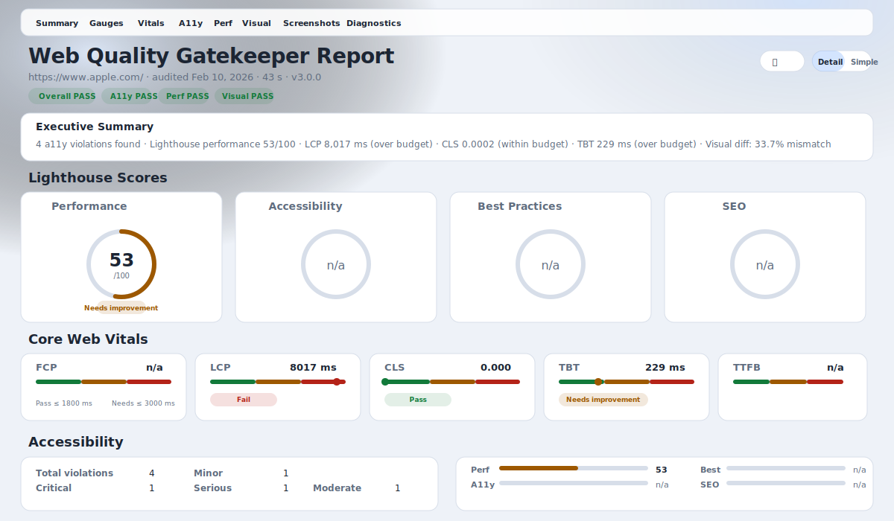

# Web Quality Gatekeeper

[](https://github.com/Jahrome907/web-quality-gatekeeper/actions/workflows/quality-gate.yml)
[](LICENSE)
[](https://nodejs.org/)
[](https://www.typescriptlang.org/)

A production-ready quality gate CLI and GitHub Action that runs Playwright smoke checks, axe accessibility scans, Lighthouse performance audits, and visual regression diffs on every PR. Outputs a clean HTML report plus a machine-readable JSON summary.



## Table of Contents

- [Features](#features)
- [Quick Start](#quick-start)
  - [GitHub Action](#github-action)
  - [CLI](#cli)
- [Baseline Workflow](#baseline-workflow)
- [Configuration](#configuration)
- [Output](#output)
- [Baseline Storage](#baseline-storage)
- [Versioning](#versioning)
- [Security](#security)
- [Development](#development)
- [Tech Stack](#tech-stack)
- [License](#license)

## Features

- **Playwright Smoke Runner** — Deterministic screenshots with configurable viewports
- **axe-core Accessibility** — WCAG compliance scanning with severity counts
- **Lighthouse Performance** — Budget enforcement for score, LCP, CLS, and TBT
- **Visual Regression** — Baseline management with pixel-level diff detection
- **HTML & JSON Reports** — Human-readable reports plus machine-readable summaries
- **GitHub Action** — Automated PR comments with results and artifact uploads

## Quick Start

### GitHub Action

Add this workflow to your repository at `.github/workflows/quality.yml`:

```yaml
name: Quality Gate
on:
  pull_request:

jobs:
  quality:
    runs-on: ubuntu-latest
    permissions:
      contents: read
      pull-requests: write
    steps:
      - uses: actions/checkout@v4
      - uses: actions/setup-node@v4
        with:
          node-version: 20
      - run: npm ci
      - uses: Jahrome907/web-quality-gatekeeper@v1
        with:
          url: https://example.com
          config: configs/default.json
          baseline-dir: baselines
          fail-on-a11y: 'true'
          fail-on-perf: 'true'
          fail-on-visual: 'true'
      - uses: actions/upload-artifact@v4
        if: always()
        with:
          name: quality-reports
          path: artifacts
```

Outputs are written to `artifacts/` (generated, not committed).

### CLI

Install and run locally:

```bash
# Install globally
npm install -g web-quality-gatekeeper

# Or use npx
npx web-quality-gatekeeper audit https://example.com

# With options
wqg audit https://example.com \
  --config configs/default.json \
  --out artifacts \
  --baseline-dir baselines
```

**Options:**

- `--set-baseline` — Overwrite baseline images
- `--no-fail-on-a11y` — Disable a11y failure gate
- `--no-fail-on-perf` — Disable performance budget gate
- `--no-fail-on-visual` — Disable visual diff gate
- `--verbose` — Enable debug logging

**Outputs:**

Generated artifacts are written to `artifacts/` (not committed to source control):
- `summary.json` — Machine-readable results
- `report.html` — Human-readable report
- `screenshots/*.png` — Current screenshots
- `diffs/*.png` — Visual diff images (when baselines exist)
- `axe.json` — Raw accessibility results
- `lighthouse.json` — Raw performance results

## Baseline Workflow

1. Run once to create baselines:

```bash
npm run audit -- https://example.com --set-baseline
```

2. Commit `baselines/` to track visual regression.

## Configuration

Default config lives at `configs/default.json`.

```json
{
  "timeouts": {
    "navigationMs": 30000,
    "actionMs": 10000,
    "waitAfterLoadMs": 1000
  },
  "playwright": {
    "viewport": { "width": 1280, "height": 720 },
    "userAgent": "wqg/0.1.0",
    "locale": "en-US",
    "colorScheme": "light"
  },
  "screenshots": [{ "name": "home", "path": "/", "fullPage": true }],
  "lighthouse": {
    "budgets": { "performance": 0.8, "lcpMs": 2500, "cls": 0.1, "tbtMs": 200 },
    "formFactor": "desktop"
  },
  "visual": { "threshold": 0.01 },
  "toggles": { "a11y": true, "perf": true, "visual": true }
}
```

## Output

Example summary from `artifacts/summary.json`:

```json
{
  "overallStatus": "pass",
  "steps": { "a11y": "pass", "perf": "pass", "visual": "pass" },
  "performance": { "metrics": { "performanceScore": 0.92, "lcpMs": 1800 } }
}
```

## Baseline Storage

Screenshot baselines are stored in `baselines/` and tracked in Git for visual regression detection. Keep the scope small to avoid repo bloat:

- Only commit baseline images for critical pages
- Prune outdated baselines when pages change significantly
- Consider [Git LFS](https://git-lfs.github.com/) if baselines exceed 10MB

Artifacts (`artifacts/`) are generated during runs and excluded from Git via `.gitignore`.

## Versioning

Pin to a stable release tag for production use:

```yaml
uses: Jahrome907/web-quality-gatekeeper@v1
```

Use `@main` only for testing unreleased features. Major version tags (`v1`, `v2`) are updated to point to the latest minor/patch release.

## Security

This action runs quality checks with minimal privileges:

- No secrets required
- Uses `contents: read` and `pull-requests: write` permissions
- Validates URLs to prevent SSRF (see [SECURITY.md](SECURITY.md))
- Runs with `--ignore-scripts` in CI to block malicious postinstall hooks

Review third-party actions and keep dependencies updated via Dependabot.

## Development

```bash
npm ci
npx playwright install
npm run check
npm run build
npm run audit -- https://example.com
```

## Tech Stack

| Technology | Purpose |
|------------|---------|
| [Playwright](https://playwright.dev/) | Browser automation & screenshots |
| [axe-core](https://github.com/dequelabs/axe-core) | Accessibility testing |
| [Lighthouse](https://developer.chrome.com/docs/lighthouse/) | Performance auditing |
| [pixelmatch](https://github.com/mapbox/pixelmatch) | Visual diff comparison |
| [Zod](https://zod.dev/) | Configuration validation |
| [Commander](https://github.com/tj/commander.js) | CLI framework |

## Author

**Jahrome** — [GitHub](https://github.com/Jahrome907)

## License

MIT — see [LICENSE](LICENSE) for details.
