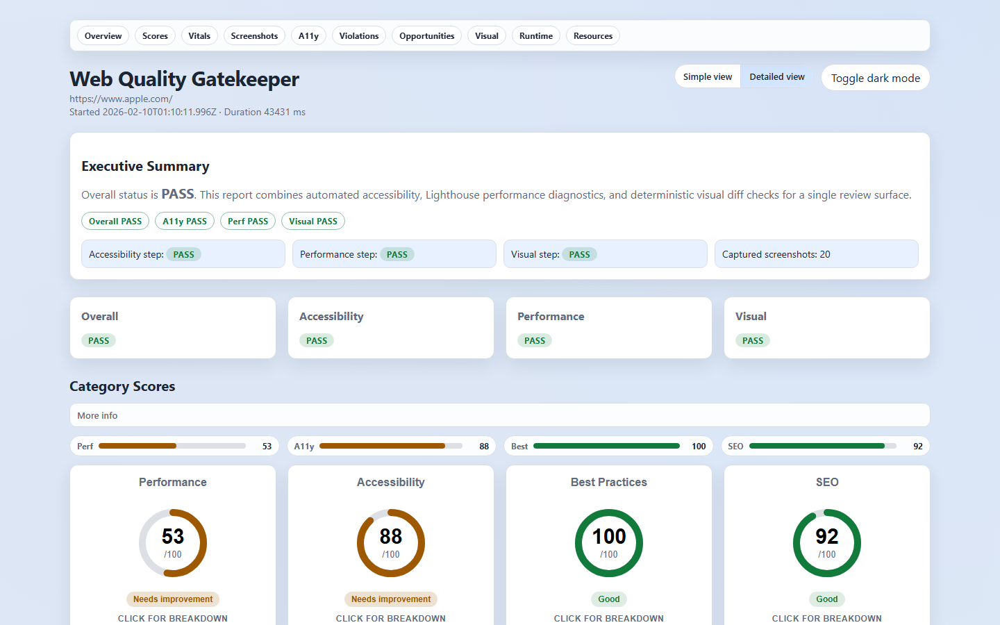

# Web Quality Gatekeeper

[](https://github.com/Jahrome907/web-quality-gatekeeper/actions/workflows/quality-gate.yml)
[](LICENSE)
[](https://nodejs.org/)
[](https://www.typescriptlang.org/)

A production-ready quality gate CLI and GitHub Action that runs Playwright smoke checks, axe accessibility scans, Lighthouse performance audits, and visual regression diffs on every PR. Outputs a clean HTML report plus machine-readable JSON summaries.

## Install

```bash
npm i -D web-quality-gatekeeper
npx playwright install                    # one-time browser download (~250 MB)
npx wqg audit https://your-site.com       # that's it — results in ~30-90 s for a single page
```

> The CLI writes `artifacts/report.html`, `artifacts/summary.json`, and `artifacts/summary.v2.json` by default.

<p align="center">
  
</p>

## Table of Contents

- [Install](#install)
- [Features](#features)
- [Quickstart](#quickstart)
- [CLI Usage](#cli-usage)
- [Baseline Workflow](#baseline-workflow)
- [Configuration](#config)
- [CI Integration](#ci-github-action)
- [Output](#output)
- [FAQ / Gotchas](#faq--gotchas)
- [Development](#development)
- [Tech Stack](#tech-stack)
- [License](#license)

## Features

- **Playwright Smoke Runner** — Deterministic screenshots with configurable viewports
- **axe-core Accessibility** — WCAG compliance scanning with severity counts
- **Lighthouse Performance** — Budget enforcement for score, LCP, CLS, and TBT
- **Visual Regression** — Baseline management with pixel-level diff detection
- **Actionable Remediation** — Prioritized fix guidance per failure with evidence and verification steps
- **Trend Dashboard** — Rolling history insights from prior snapshots (`trends/dashboard.html`)
- **Policy Templates** — Built-in multi-page/site templates (`marketing`, `docs`, `ecommerce`, `saas`)
- **HTML & JSON Reports** — Human-readable reports plus machine-readable summaries
- **GitHub Action + Workflow Template** — Composite Action for consumer repos, plus this repo's hardened CI workflow

## Quickstart

```bash
npm ci
npx playwright install
npm run build
npm run audit -- https://example.com
```

Open `artifacts/report.html` for the HTML report and `artifacts/summary.json` / `artifacts/summary.v2.json` for summary data.

## CLI Usage

```bash
wqg audit <url> [options]
```

Common options:

```bash
wqg audit https://example.com \
  --config configs/default.json \
  --out artifacts \
  --baseline-dir baselines
```

Flags:

- `--set-baseline` overwrites baseline images
- `--policy <name|path>` overlays a built-in policy or policy JSON
- `--list-policies` prints built-in policy names and exits
- `--allow-internal-targets` allows internal/private targets during CI or authenticated audits
- `--no-fail-on-a11y` disables a11y failure gate
- `--no-fail-on-perf` disables performance budget gate
- `--no-fail-on-visual` disables visual diff gate
- `--format <json|html|md>` controls stdout/report format mode
- `--header "Name: Value"` adds a request header (repeatable)
- `--cookie "name=value"` adds a cookie (repeatable)
- `--verbose` for debug logging

Built-in policies are host-agnostic defaults (paths, budgets, toggles); the target host still comes from `wqg audit <url>` unless your config explicitly sets `urls`.

## Baseline Workflow

1. Run once to create baselines:

```bash
npm run audit -- https://example.com --set-baseline
```

1. Commit `baselines/` to track visual regression.

## Config

Default config lives at `configs/default.json`.

```json
{
  "timeouts": {
    "navigationMs": 30000,
    "actionMs": 10000,
    "waitAfterLoadMs": 1000
  },
  "playwright": {
    "viewport": { "width": 1280, "height": 720 },
    "userAgent": "wqg/3.0.0",
    "locale": "en-US",
    "colorScheme": "light"
  },
  "screenshots": [{ "name": "home", "path": "/", "fullPage": true }],
  "screenshotGallery": {
    "enabled": false,
    "maxScreenshotsPerPath": 12
  },
  "lighthouse": {
    "budgets": { "performance": 0.8, "lcpMs": 2500, "cls": 0.1, "tbtMs": 200 },
    "formFactor": "desktop"
  },
  "visual": { "threshold": 0.01 },
  "toggles": { "a11y": true, "perf": true, "visual": true }
}
```

## CI (GitHub Action)

This repo includes:

- A composite Action (`action.yml`) you can call from your own workflows.
- A hardened workflow (`.github/workflows/quality-gate.yml`) used by this repository.

Workflow behavior (`.github/workflows/quality-gate.yml`):

- If `package.json` has a `demo` script, it audits `http://localhost:4173`.
- Otherwise it audits a remote URL (`WQG_URL` override, else GitHub Pages fallback).
- All gates are blocking by default, including remote audits.
- Set `WQG_RELAXED_REMOTE=true` to make remote mode non-blocking (`--no-fail-on-a11y --no-fail-on-perf --no-fail-on-visual`).
- If authenticated inputs are detected (`WQG_AUTH_HEADER(S)` / `WQG_AUTH_COOKIE(S)`) or `WQG_SENSITIVE_AUDIT=true`, artifact upload and PR comments are disabled by default.
- Set `WQG_ALLOW_SENSITIVE_OUTPUTS=true` only when you intentionally want to publish outputs for a sensitive run.
- Internal/private targets are blocked by default in CI and authenticated runs unless you explicitly set `--allow-internal-targets` or `WQG_ALLOW_INTERNAL_TARGETS=true`.
- Public targets are DNS-resolved and pinned before Playwright/Lighthouse execution so redirect chains and follow-on requests cannot silently pivot into private network space during sensitive runs.

## Output

Artifacts written to the output directory:

- `summary.json`
- `summary.v2.json`
- `report.html`
- `action-plan.md`
- `screenshots/*.png`
- `diffs/*.png` (when baselines exist)
- `axe.json`
- `lighthouse.json`
- `pages/*` (multi-target audits)
- `trends/history.json` and `trends/dashboard.html` (when `trends.enabled` is true)

Example summary snippet:

```json
{
  "overallStatus": "pass",
  "steps": { "a11y": "pass", "perf": "pass", "visual": "pass" },
  "performance": { "metrics": { "performanceScore": 0.92, "lcpMs": 1800 } }
}
```

## Development

```bash
npm ci
npx playwright install
npm run check
npm run security:audit
npm run build
npm run audit -- https://example.com
```

## Tech Stack

| Technology | Purpose |
|------------|---------|
| [Playwright](https://playwright.dev/) | Browser automation & screenshots |
| [axe-core](https://github.com/dequelabs/axe-core) | Accessibility testing |
| [Lighthouse](https://developer.chrome.com/docs/lighthouse/) | Performance auditing |
| [pixelmatch](https://github.com/mapbox/pixelmatch) | Visual diff comparison |
| [Zod](https://zod.dev/) | Configuration validation |
| [Commander](https://github.com/tj/commander.js) | CLI framework |

## FAQ / Gotchas

<details>
<summary><strong>What Node.js version do I need?</strong></summary>

Node **20 or later** is required (`engines.node` is set to `>=20`). Earlier versions are not tested and may fail.
</details>

<details>
<summary><strong>Why is the first run so slow?</strong></summary>

`npx playwright install` downloads Chromium (and optionally Firefox/WebKit) browsers. This is a one-time cost (~250 MB). In CI, cache `~/.cache/ms-playwright` to skip repeated downloads.
</details>

<details>
<summary><strong>What should I commit from the baselines workflow?</strong></summary>

- **Commit:** `baselines/*.png` — these are reference screenshots for visual regression.
- **Do not commit:** `artifacts/` — generated every run. Add it to `.gitignore`.

</details>

<details>
<summary><strong>How long does a full audit take in CI?</strong></summary>

Roughly **30–90 seconds** depending on page complexity, Lighthouse throttling, and runner specs. The GitHub-hosted `ubuntu-latest` runners typically finish in under a minute for a single-page audit.
</details>

<details>
<summary><strong>Can I audit multiple pages?</strong></summary>

Yes — add entries to the `screenshots` array in your config. Each entry gets its own screenshot, axe scan, and visual diff.
</details>

## Author

**Jahrome** — [GitHub](https://github.com/Jahrome907)

## License

MIT — see [LICENSE](LICENSE) for details.
