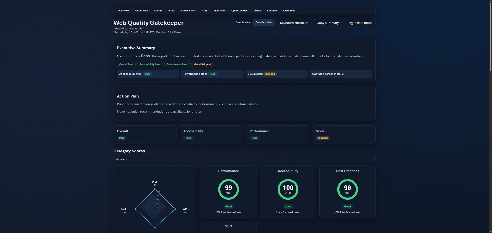

# Web Quality Gatekeeper

[](https://github.com/Jahrome907/web-quality-gatekeeper/actions/workflows/quality-gate.yml)
[](https://github.com/Jahrome907/web-quality-gatekeeper/actions/workflows/action-smoke.yml)
[](LICENSE)
[](https://nodejs.org/)

Web Quality Gatekeeper runs Playwright smoke checks, axe accessibility scans, Lighthouse budgets, and visual comparisons in one CI job. It produces a readable HTML report plus JSON and Markdown artifacts for automation. Contract-checked JSON formats are covered by versioned schemas and contract tests.

Use the GitHub Action at `Jahrome907/web-quality-gatekeeper@v3` or install the CLI from npm. GitHub [tags and Releases](https://github.com/Jahrome907/web-quality-gatekeeper/releases) identify published versions; source builds are available for contributors.

The CLI is also available on [npm](https://www.npmjs.com/package/web-quality-gatekeeper):

```bash
npm install --save-dev web-quality-gatekeeper@3.2.7
npx playwright install chromium
npx wqg audit https://your-site.example
```

[](https://jahrome907.github.io/web-quality-gatekeeper/proof/fixture-report.html)

The screenshot links to a committed fixture report from version 3.2.4. Its supporting JSON, configuration, and reproduction steps are included in this repository.

The [project-site case study](https://jahrome907.github.io/web-quality-gatekeeper/case-study/project-pages.html) compares two actual site revisions and demonstrates a missing-alt regression producing a failed audit, an actionable report, and exit code 1. It includes the complete evidence bundle and reproduction script.

## Use it in GitHub Actions

Add a job like this to your workflow. See the full [consumer example](examples/consumer-workflow.yml) for optional inputs, pinned action SHAs, and safe report uploads.

```yaml
jobs:
  web-quality:
    runs-on: ubuntu-latest
    env:
      WQG_SENSITIVE_AUDIT: "false"
      WQG_ALLOW_SENSITIVE_OUTPUTS: "false"
    steps:
      - uses: actions/checkout@df4cb1c069e1874edd31b4311f1884172cec0e10 # v6.0.3
        with:
          persist-credentials: false
      - id: wqg
        uses: Jahrome907/web-quality-gatekeeper@v3
        with:
          url: https://your-site.example
          baseline-dir: .github/web-quality/baselines
      - name: Upload audit artifacts
        if: always() && (steps.wqg.outputs.sensitive-audit != 'true' || env.WQG_ALLOW_SENSITIVE_OUTPUTS == 'true')
        uses: actions/upload-artifact@043fb46d1a93c77aae656e7c1c64a875d1fc6a0a # v7.0.1
        with:
          name: wqg-artifacts
          path: |
            ${{ steps.wqg.outputs.summary-path }}
            ${{ steps.wqg.outputs.summary-v2-path }}
            ${{ steps.wqg.outputs.report-path }}
            ${{ steps.wqg.outputs.action-plan-path }}
            ${{ steps.wqg.outputs.pr-risk-ledger-path }}
            ${{ steps.wqg.outputs.pr-risk-ledger-md-path }}
          if-no-files-found: warn
```

The `policy` input is optional; this minimal example uses the Action defaults. The Action exposes `status`, artifact path outputs, and `sensitive-audit`. Authenticated or internal audits should keep artifact publication disabled unless the output is deliberately safe to share.

## Run from source

```bash
git clone https://github.com/Jahrome907/web-quality-gatekeeper.git
cd web-quality-gatekeeper
npm run engines:check
npm ci
npx playwright install chromium
npm run build
node dist/cli.js audit https://your-site.example --policy marketing
```

Audits write results under `artifacts/`, including when a completed check fails its quality gate:

- `report.html`
- `summary.json` and `summary.v2.json`
- `action-plan.md`
- `pr-risk-ledger.json` and `pr-risk-ledger.md`
- screenshots, Lighthouse/axe payloads, and visual diffs when enabled

Open `artifacts/report.html` for the human report. Automation should consume the JSON artifacts and validate stable contracts against the schemas in [`schemas/`](schemas/summary.v2.json).

## CLI essentials

```bash
npx wqg audit [url] [options]
npx wqg init --profile marketing --url https://your-site.example
npx wqg doctor --config .github/web-quality/config.json
```

The positional URL is optional when the config supplies `urls`. Common audit options include:

- `--config <path>` and `--policy <name|path>`
- `--out <dir>` and `--baseline-dir <dir>`
- `--set-baseline`
- `--format <json|json-v2|html|md|pr-risk-ledger|action-plan>`
- `--header "Name: Value"` and `--cookie "name=value"`
- `--allow-internal-targets`
- `--no-fail-on-a11y`, `--no-fail-on-perf`, and `--no-fail-on-visual`

Built-in policies are `marketing`, `docs`, `ecommerce`, and `saas`. Screenshot paths must be `@target` or start with a single `/`; protocol-relative paths such as `//example.com/path` are rejected.

To establish visual baselines:

```bash
npx wqg audit https://example.com --set-baseline --baseline-dir .github/web-quality/baselines
```

Commit reviewed baseline images. Do not commit ordinary `artifacts/` output.

## What it checks

- Playwright navigation and runtime error capture
- Screenshot capture
- axe-core accessibility violations
- Lighthouse performance budgets
- Pixel-level visual diffs
- Optional source-checkout Rust visual diff engine
- Multi-page rollups
- Trend history
- Prioritized remediation
- PR risk summaries

The target host comes from the audit URL or config. Built-in policies supply paths, budgets, and toggles; they never replace the requested host.

## Security

Only audit sites you trust. Reports can contain page content, screenshots, URLs, and authenticated data. Internal/private targets are blocked by default in CI and authenticated runs unless explicitly allowed. Read [SECURITY.md](SECURITY.md) before using credentials, internal targets, or native binaries.

## Proof and contracts

Inspect the published [fixture report](https://jahrome907.github.io/web-quality-gatekeeper/proof/fixture-report.html), [summary v2](https://jahrome907.github.io/web-quality-gatekeeper/proof/fixture-summary.v2.json), [PR Risk Ledger](https://jahrome907.github.io/web-quality-gatekeeper/proof/fixture-pr-risk-ledger.json), and [proof config](https://jahrome907.github.io/web-quality-gatekeeper/proof/fixture-proof-config.json).

Reproduce that bundle with [the fixture walkthrough](docs/case-study-run.md). Public comparison studies should follow the [evidence protocol](docs/case-study/public-oss-repro.md). Contract and trust references:

- [Compatibility baseline](docs/contracts/compatibility-baseline.md)
- [Summary v1](docs/contracts/summary-v1-contract.md), [summary v2](docs/contracts/summary-v2-contract.md), and [PR Risk Ledger](docs/contracts/pr-risk-ledger-v1-contract.md)
- [Architecture map](docs/engineering/ARCHITECTURE_MAP.md) and [testing matrix](docs/testing-matrix.md)
- [Provenance](docs/provenance.md) and [SBOM](docs/sbom.md)
- [Optional Python analytics tooling](tools/python/README.md) for case-study artifact post-processing; the core CLI and Action do not require Python
- [Roadmap](docs/roadmap.md)

## Contributing

See [CONTRIBUTING.md](CONTRIBUTING.md) for setup, validation, and pull request expectations. Security reports belong in GitHub's private vulnerability reporting flow described in [SECURITY.md](SECURITY.md).

## License

MIT. See [LICENSE](LICENSE).
