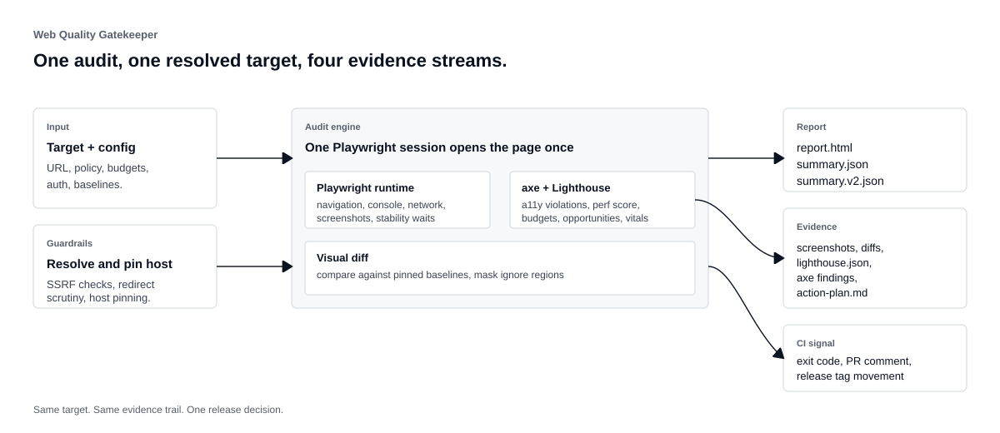
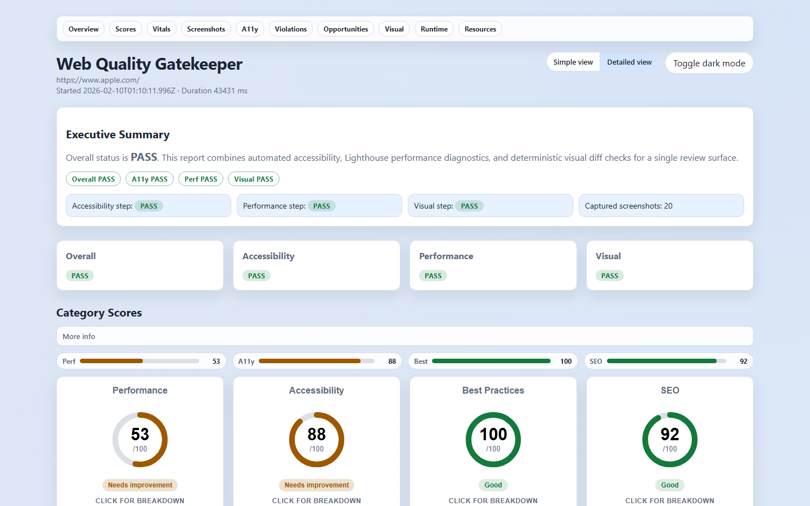

# Web Quality Gatekeeper

[](https://github.com/Jahrome907/web-quality-gatekeeper/actions/workflows/quality-gate.yml)
[](LICENSE)
[](https://nodejs.org/)

Web Quality Gatekeeper is a CLI and GitHub Action for checking a page before it ships. It combines browser smoke checks, accessibility scans, Lighthouse budgets, and visual diffs into one reviewable result.

[View the sample report](https://jahrome907.github.io/web-quality-gatekeeper/proof/fixture-report.html) / [Open the project site](https://jahrome907.github.io/web-quality-gatekeeper/) / [Browse releases](https://github.com/Jahrome907/web-quality-gatekeeper/releases)

<p align="center">
  
</p>

## When it helps

| Situation | What it checks | What reviewers get |
| --- | --- | --- |
| A new landing page or redesign | Navigation, console errors, accessibility, performance budgets, and screenshots | A report that links failures to the captured evidence |
| A pull request that can change UI | The same checks in CI, with a pass or fail signal | JSON summaries and a Markdown risk ledger for automation or review |
| A release that needs a visual safety net | Baseline screenshots and pixel-level comparisons | Current, baseline, and diff images alongside the report |

## Start with the GitHub Action

Use the stable `v3` action tag in the repository you want to check.

```yaml
name: Web quality

on:
  pull_request:

jobs:
  audit:
    runs-on: ubuntu-latest
    steps:
      - uses: actions/checkout@df4cb1c069e1874edd31b4311f1884172cec0e10 # v6.0.3
        with:
          persist-credentials: false

      - id: quality
        uses: Jahrome907/web-quality-gatekeeper@v3
        with:
          url: https://your-site.example
          baseline-dir: .github/web-quality/baselines

      - name: Upload the report
        if: always()
        uses: actions/upload-artifact@043fb46d1a93c77aae656e7c1c64a875d1fc6a0a # v7.0.1
        with:
          name: web-quality-report
          path: |
            ${{ steps.quality.outputs.report-path }}
            ${{ steps.quality.outputs.summary-v2-path }}
            ${{ steps.quality.outputs.action-plan-path }}
            ${{ steps.quality.outputs.pr-risk-ledger-md-path }}
          if-no-files-found: warn
```

For authenticated or internal targets, read the [security policy](SECURITY.md) before enabling sensitive audits or publishing artifacts.

## Run it from a source checkout

This is the supported local path while you are evaluating or contributing to the project.

```bash
git clone https://github.com/Jahrome907/web-quality-gatekeeper.git
cd web-quality-gatekeeper
npm run engines:check
npm ci
npx playwright install chromium
npm run build
node dist/cli.js audit https://your-site.example --policy marketing
```

Start with `node dist/cli.js doctor --json` when you want to confirm the local browser, configuration, and output path before a full audit.

## What a run produces

<p align="center">
  
</p>

| Artifact | Use it for |
| --- | --- |
| `report.html` | A human-readable view of the run, including screenshots and findings |
| `summary.json` and `summary.v2.json` | Dashboards, PR automation, and custom CI checks |
| `action-plan.md` | A concise, ordered remediation list |
| `pr-risk-ledger.json` and `.md` | Merge-review context for page, runtime, and visual risk |
| screenshots and visual diffs | Proof of what the browser saw and what changed |

The [published fixture](https://jahrome907.github.io/web-quality-gatekeeper/) includes the report, machine-readable summary, screenshots, configuration, and raw Lighthouse data from the same sample run.

## Configure the checks

The defaults are in [`configs/default.json`](configs/default.json). Built-in policies cover common site shapes such as marketing pages, documentation, ecommerce, and SaaS. Use a consumer-owned configuration such as `.github/web-quality/config.json` for URLs, budgets, screenshots, and baseline paths.

```bash
node dist/cli.js init --profile marketing --url https://your-site.example
```

The generated scaffold does not overwrite existing files unless `--force` is provided. The [Action reference](action.yml) documents inputs and outputs; use the default configuration as the reference for supported settings.

## Project docs

| Need | Where to go |
| --- | --- |
| See real output first | [Sample report](https://jahrome907.github.io/web-quality-gatekeeper/proof/fixture-report.html) and [summary](https://jahrome907.github.io/web-quality-gatekeeper/proof/fixture-summary.v2.json) |
| Reproduce the fixture | [Case-study walkthrough](docs/case-study-run.md) |
| Understand the codebase | [Architecture map](docs/engineering/ARCHITECTURE_MAP.md) |
| Choose the right test command | [Testing matrix](docs/testing-matrix.md) |
| Review compatibility contracts | [Compatibility and output contracts](docs/contracts/compatibility-baseline.md) |
| Report a vulnerability | [Security policy](SECURITY.md) |

## Development

```bash
npm run engines:check
npm ci
npx playwright install chromium
npm run check
npm test
```

Use `npm run validate:full` before release-sensitive changes. See [CONTRIBUTING.md](CONTRIBUTING.md) for the focused validation commands, supported Node versions, and release workflow notes.

Versioned releases and Action tags are published from [GitHub Releases](https://github.com/Jahrome907/web-quality-gatekeeper/releases). The `package.json` version on `main` can move ahead while a release is being prepared.

## License

[MIT](LICENSE)
